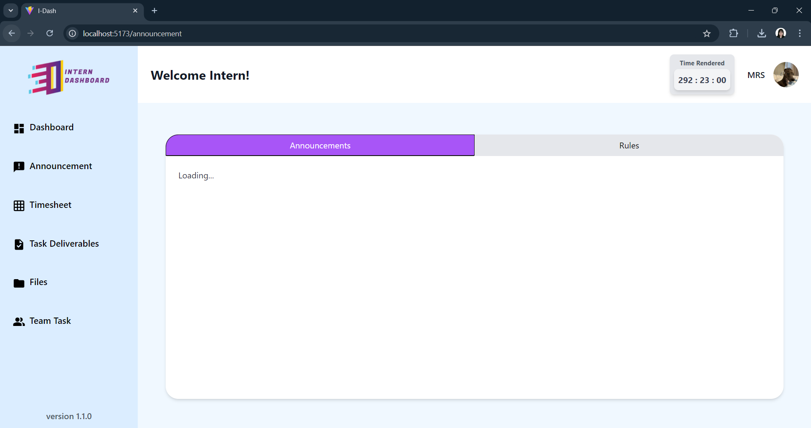
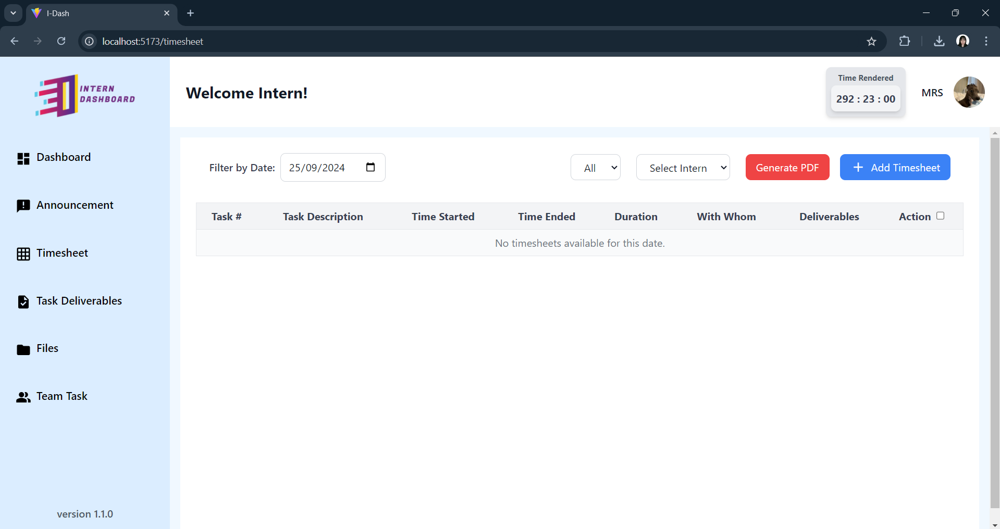
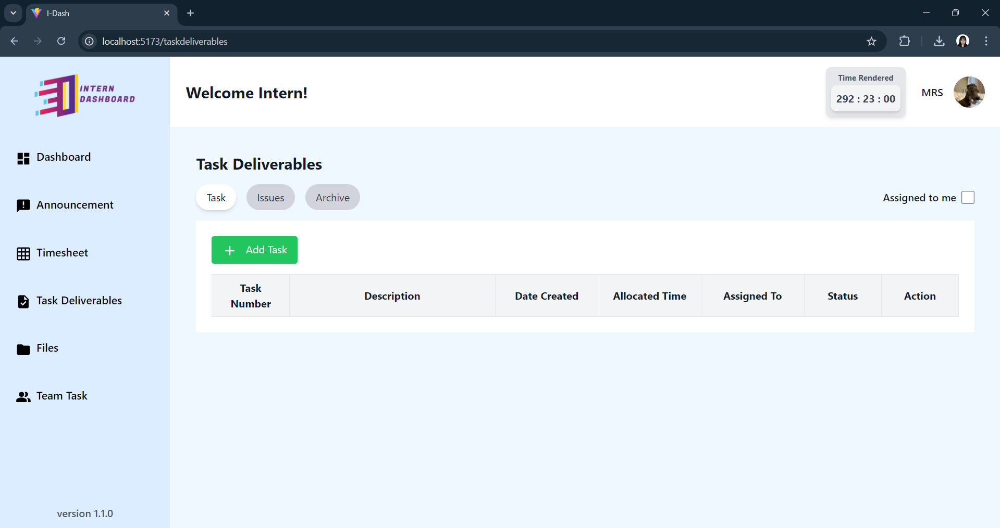
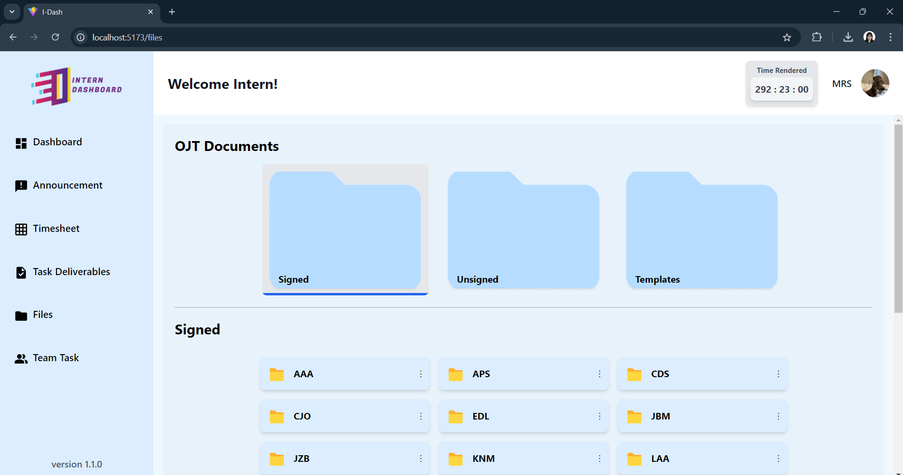
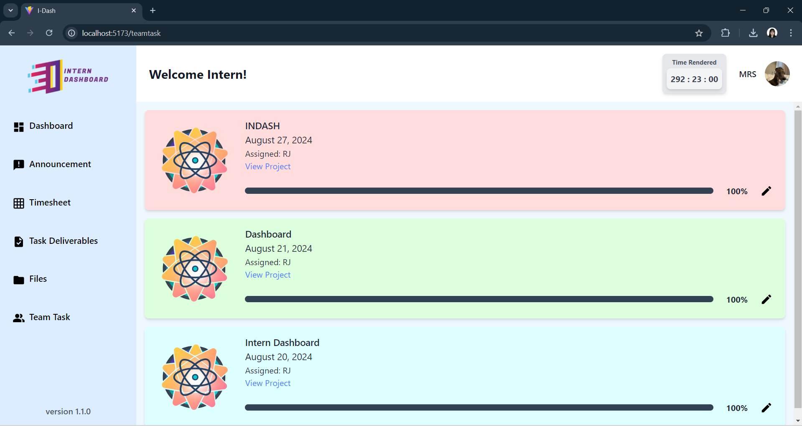
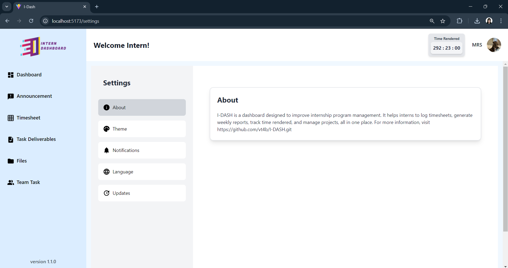

# I-DASH
# Intern Dashboard Documentation

## Table of Contents
1. [Introduction](#introduction)
2. [Prerequisites](#prerequisites)
3. [Initial Installation](#initial-installation)
4. [Functions](#functions)
5. [User Guide](#user-guide)

## Introduction
**I-Dash** is a comprehensive dashboard designed to enhance the management of internship programs. It offers a variety of features that allow users to efficiently log timesheets, generate reports, manage team projects, and more. With I-Dash, interns and group leaders can collaborate and stay organized on a centralized platform.

## Prerequisites
Before setting up I-Dash, ensure you have the following installed:

- [Node.js](https://nodejs.org/) (v14.x or later)
- [npm](https://www.npmjs.com/) (v6.x or later)

## Initial Installation
### Step-by-Step Guide
1. Clone the repository:
   ```bash
   git clone https://github.com/vt4b/I-DASH.git
   cd i-dash
   ```

2. Install dependencies:
   ```bash
   npm install
   ```

3. Set up environment variables:
   - Open the `.env` file and use your intern credentials to access your account.

   Example:
   ```bash
   VITE_API_BASE_URL=https://idash.visible.team/wp-json/wp/v2/
   

   #INTERN
   VITE_AUTH_USERNAME=USERNAME
   VITE_AUTH_PASSWORD=PASSWORD
   ```

4. Start the development server:
   ```bash
   npm run dev
   ```

5. Access the dashboard at `http://localhost:5173/`.

## Introduction
**I-Dash** is a comprehensive dashboard designed to enhance the management of internship programs. It offers a variety of features that allow users to efficiently log timesheets, generate reports, manage team projects, and more. With I-Dash, interns and group leaders can collaborate and stay organized on a centralized platform.

## Functions 
### 1. Dashboard
- **Zoom Meeting**: Access the Zoom meeting link for daily meetings.
- **Recording Link**: Watch previous meeting recordings for reference.
- **Calendar**: View the current month with highlighted dates.
- **Ongoing Projects Tracker**: Displays active projects, assignment dates, assigned groups, and progress.


### 2. Announcements
- View and post important announcements.
- Stay informed about internship rules and guidelines.



### 3. Timesheet
- Log working hours and view time entries.
- Generate timesheet reports in PDF format.
- Filter by date and select specific interns for viewing.
- Used by group leaders during daily status meetings.


### 4. Task Deliverables
- Track assigned tasks, issues, and archives.
- Editable only by group leaders.



### 5. Files
- Access and manage uploaded internship-related files, including OJT documents, media files, and other task deliverables.

 

### 6. Team Task
- Monitor team tasks and overall project progress.


### 7. Time Rendered
- Tracks the total time worked throughout the program, connected to the timesheet feature.


### 8. Profile
- Edit personal information, internship details, and add a digital signature for your weekly report.

### 9. Notifications
- Notify interns about newly posted announcements, tasks, and rules.

### 10. Settings
- **About**: Information about the application.
- **Theme**: Customize the dashboard's appearance by switching between light mode and dark mode.
- **Notifications**: Manage notification preferences.
- **Language**: Set your preferred interface language.
- **Updates**: Stay informed about the latest features and changes.



## User Guide
### Generate PDF Feature
1. Click the "Generate PDF" button, then choose a week to generate.
2. Check the checklist to select or deselect activities you want to include or exclude from your weekly report.
3. Once you’re done customizing activities, proceed to the PDF preview and check the output.
4. Drag your signature to the correct place. Ensure you have uploaded your signature on the Profile page.
5. Download the PDF.

### Thank you for using I-Dash!

